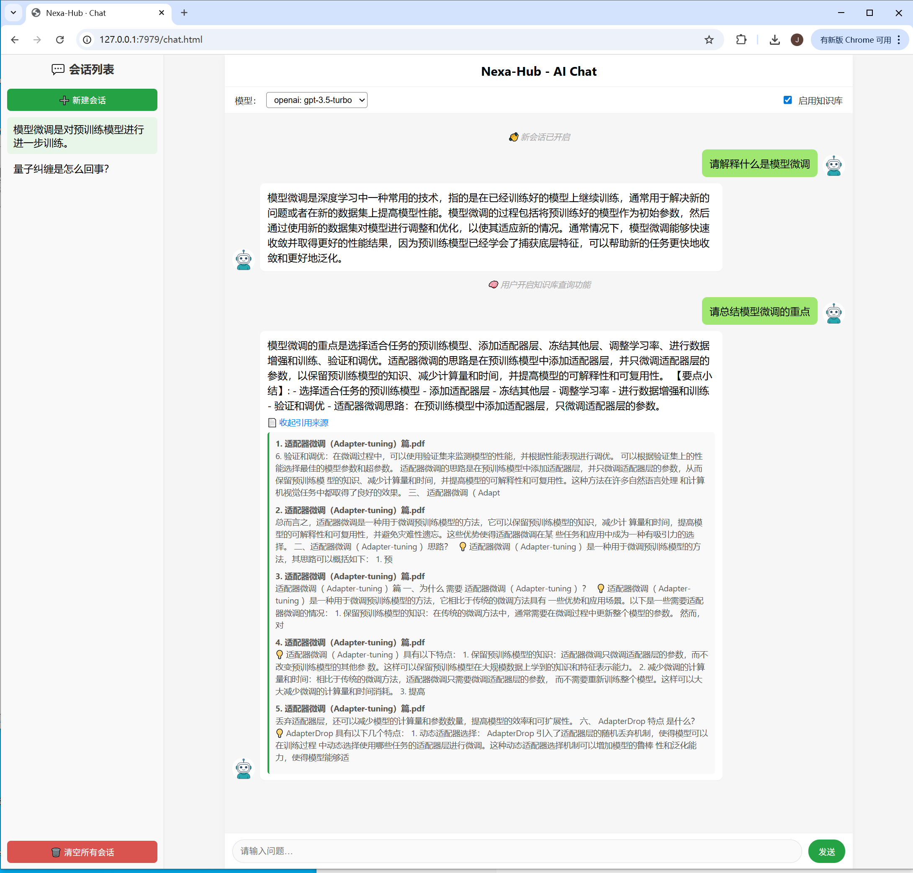
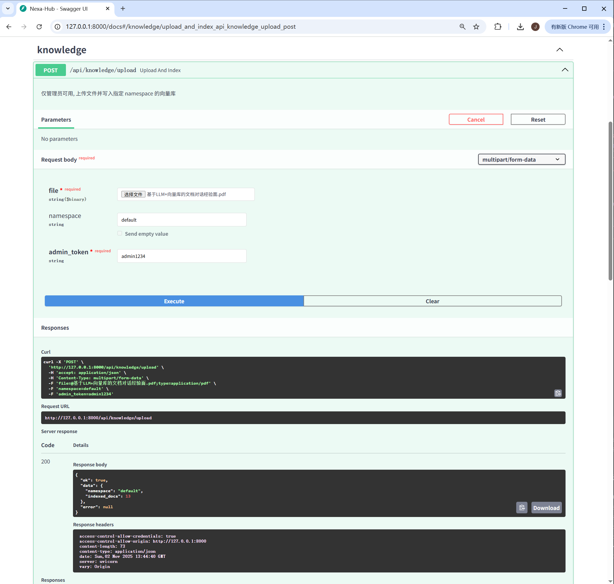

# 🧠 Nexa-Hub

> 💬 一个统一的多模型智能对话与知识检索平台，支持接入多家大模型（OpenAI、Qwen、Gemini 等），并提供本地知识库索引（RAG）能力。

---

## 🚀 功能概览

| 模块 | 说明 |
|------|------|
| 💬 **Chat 模块** | 调用多种大模型进行上下文对话（统一 `/api/chat` 接口）。 |
| 📚 **Knowledge 模块（RAG）** | 支持文件上传、文本分块、向量化、检索与问答。 |
| 🧩 **Session 记忆** | 在同一 `session_id` 下保存多轮上下文。 |
| ⚙️ **Model Registry** | 支持多模型注册与动态切换。 |
| 🌐 **Web 前端** | 简洁的微信风格聊天界面。 |

---

## 🗂️ 项目结构

```
nexa-hub/
├── app/                    # FastAPI 路由入口
│   ├── main.py
│   └── routers/
│       ├── chat_api.py
│       ├── knowledge_api.py
│       └── model_api.py
│
├── core/                   # 核心逻辑模块
│   ├── bridge_manager.py   # 统一消息调度
│   ├── dialogue_service.py # 会话与上下文管理
│   ├── message.py          # 消息对象定义
│   ├── model_registry.py   # 模型注册与加载
│   ├── rag_engine.py       # 知识检索与问答（RAG 入口）
│   ├── session.py          # 会话数据结构
│   └── reply.py            # 统一响应对象
│
├── bots/                   # 各大模型封装
│   ├── base_bot.py
│   ├── openai_bot.py
│   ├── qwen_bot.py
│   ├── claude_bot.py
│   └── gemini_bot.py
│
├── knowledge/              # 本地知识库与索引管理
│   ├── embeddings.py
│   ├── rag_pipeline.py
│   ├── vector_store.py
│   ├── loader.py
│   └── splitter.py
│
├── infrastructure/         # 基础设施层
│   ├── config_manager.py   # 配置加载
│   ├── logger.py           # 日志封装
│   └── utils.py            # 通用工具
│
├── web/                    # 前端静态页面
│   ├── templates/
│   │   └── chat.html       # 主聊天界面
│   └── static/
│       └── images/avatars/ # 头像等资源
│
├── data/                   # 用户上传文件与向量存储
│   ├── uploads/
│   └── vector_stores/
│
├── requirements.txt        # 项目依赖
├── config.json             # 配置文件
└── README.md               # 当前文档
```

---

## ⚙️ 安装与运行

### 1️⃣ 克隆项目

```bash
git clone https://github.com/yourname/nexa-hub.git
cd nexa-hub
```

### 2️⃣ 安装依赖

```bash
pip install -r requirements.txt
```

### 3️⃣ 配置项目参数
请将项目根目录下的 `config_template.json` 复制为 `config.json`：

```bash
cp config_template.json config.json
```

然后在 `config.json` 中配置对应参数，例如：

```json
{
  "openai_api_key": "sk-xxxx",
  "openai_base_url": "https://api.openai.com/v1",
  "default_model": "gpt-3.5-turbo",
  "allowed_models": []
}
```


### 4️⃣ 启动服务
#### 4.1️⃣ 启动后端服务
```bash
uvicorn app.main:app --reload --port 8000
```

访问地址：
```
http://127.0.0.1:8000/api/chat/
http://127.0.0.1:8000/api/knowledge/query
```

---

#### 4.2️⃣ 启动前端服务

在 `web/templates` 目录下运行：

```bash
cd web/templates
python -m http.server 7979
```

然后访问：
```
http://127.0.0.1:7979/chat.html
```


---

## 🧩 示例截图（可后续补充）

| 页面 | 截图 |
|------|------|
| 聊天界面 |  |
| 知识库上传 |  |

---

## 🧠 技术亮点

- 🔌 **多模型统一注册与切换**：支持 `OpenAI`、`Qwen`、`Gemini`、`Claude` 等模型接入；
- 📚 **RAG（Retrieval-Augmented Generation）**：结合 FAISS 向量索引，实现企业文档问答；
- 💾 **Session 持久化设计**：多轮上下文记忆、自动会话命名；
- 🧱 **模块化架构**：前后端分离、层次清晰、方便扩展；
- 🧩 **可扩展 Agent 架构**：为未来接入 LangChain、语音、图像等 Agent 做好预留；
- 🌐 **统一 Web 前端**：微信风格聊天界面，支持知识库状态提示、消息来源展示。

---

## 🧭 未来规划

- 🤖 接入 **LangChain Agent**，支持工具调用与函数执行；
- 🔉 增加 **语音输入/输出** 功能；
- 🖼️ 增加 **图像识别** 与视觉问答；
- 🗄️ 支持 **多用户多会话持久化存储（SQLite / PostgreSQL）**；
- 📦 优化 **知识库索引构建性能**；
- ☁️ 支持 **Docker 一键部署**。

---

## 📜 License

MIT License © 2025 Nexa-Hub Team
