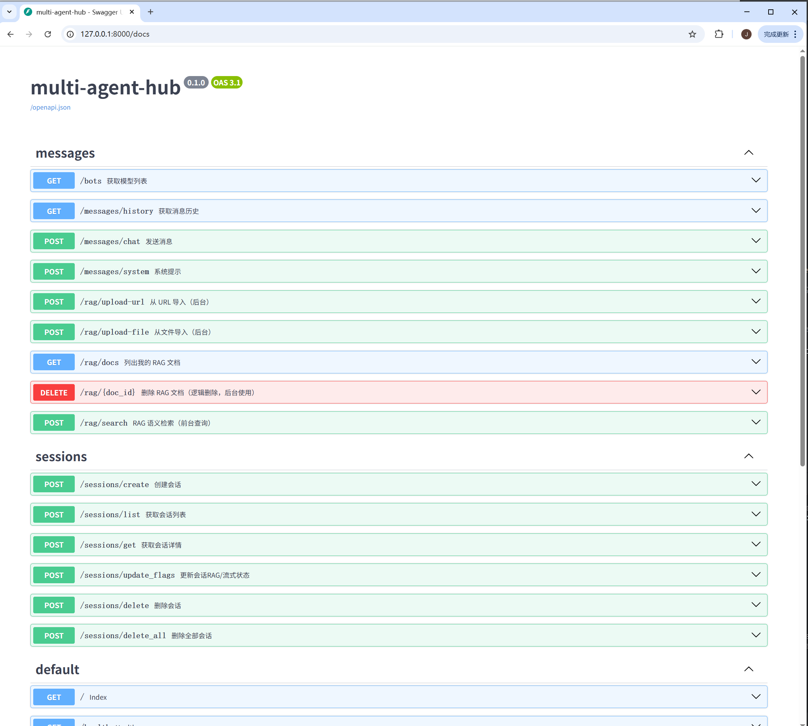

# Multi‑Agent Hub (Yaccii Edition)

> 轻量、可落地的多模型对话与RAG框架。支持会话管理、流式输出、可折叠的数据来源、RAG 文档库、MySQL 持久化、可插拔 Bot 与存储实现。

---

## ✨ 特性一览

- **即插即用的多模型 Bot 架构**：`bots/` 注册中心（支持自定义，如 Claude、OpenAI、DeepSeek 等）。  
- **稳健的消息管线**：历史上下文裁剪、长度控制、会话自动命名。  
- **RAG 集成**：RAG 文档入库、分片、检索，前端展示。  
- **会话持久化**：MySQL 存储（同时提供内存版 `MemoryStorage`）。  
- **前端体验**：
  - `chat.html` 极简单页。
  - 支持「流式输出」「启用RAG」独立开关与系统提示。
- **API**：`/sessions/*`、`/messages/*` 路由与返回结构稳定。  
- **代码结构清晰**：`core/` 业务服务层、`domain/` 数据模型、`infrastructure/` 基础设施抽象。

---

## 📦 目录结构（核心）

```
.
├─ bots/                   # Bot 接入（e.g. Claude、OpenAI），注册中心在 bots/bot_registry.py
├─ core/
│  ├─ message_service.py   # 统一消息管线：历史、RAG、流式、持久化、自动命名
│  └─ session_service.py   # 会话生命周期：创建、列表、删除、flag 同步
├─ domain/
│  ├─ enums.py             # Channel/Role 等
│  ├─ message.py           # Message/RagSource
│  └─ session.py           # Session
├─ infrastructure/
│  ├─ config_manager.py    # 配置读取
│  ├─ response.py          # success/failure 统一返回
│  ├─ storage_manager.py   # IStorage 选择（MySQL / Memory）
│  └─ mlogger.py           # 简易日志
├─ routers/
│  ├─ message_router.py    # /messages/*
│  └─ session_router.py    # /sessions/*
├─ storage/
│  ├─ base.py              # IStorage 接口
│  ├─ mysql_storage.py     # MySQL 实现（建表、自恢复、批量写入）
│  └─ memory_storage.py    # 内存实现（开发调试）
└─ web/
   └─ chat.html            # 前端单页（纯原生 DOM）
```

---

## 🚀 快速开始

### 1) 环境要求

- Python 3.10+
- MySQL 5.7+/8.0+
- 推荐：创建虚拟环境并安装依赖

```bash
pip install -r requirements.txt
```

### 2) 配置

在 `infrastructure/config_manager.py` 所读取的配置文件或环境变量中，设置：

- **数据库**：
  - `MYSQL_HOST` / `MYSQL_PORT` / `MYSQL_USER` / `MYSQL_PASSWORD` / `MYSQL_DB`
- **会话与消息限制（可选）**：
  - `max_sessions`（默认 50）
  - `max_messages_count`（默认 200）
  - `max_messages_length`（默认 8000）
- **模型密钥**：对应 Bot 的密钥，如：
  - `ANTHROPIC_API_KEY`
  - `OPENAI_API_KEY`
  - …

> 首次运行时 `MySQLStorage` 会自动建表（`chat_sessions`/`chat_messages`/`rag_documents`/`rag_chunks`）。

### 3) 启动后端

以 FastAPI/Uvicorn 为例：

```bash
uvicorn main:app --reload --port 8000
```

### 4) 打开前端

开发阶段直接用浏览器打开：

```
web/chat.html
```

> 若使用后端静态托管，可将 `web/` 配置为静态目录。

---

## 🖥️ 前端使用说明（`web/chat.html`）

- 工具栏：**模型选择**、**流式输出**(`ck-stream`)、**启用RAG**(`ck-rag`)；状态提示。  
- 会话列表：时间倒序，支持删除；切换会话自动同步 `rag/stream` 开关状态。  
- 消息区：
  - 用户与助手双列头像气泡。
  - 助手消息下方为 **「数据来源」折叠面板**（仅 RAG 时出现），点击展开/收起。
- 系统提示：切换 `rag/stream` 时在消息流内插入提示。

**效果图（示意）：**



---

## 🔌 API 速览

### Sessions

- `POST /sessions/create`
  - body: `{ "user_id": 1, "bot_name": "claude-3-5-haiku-20241022", "channel": "web" }`
  - resp: `{ "session_id": "uuid" }`
- `POST /sessions/list?user_id=1`
  - resp: `[{ session... }]`
- `POST /sessions/delete?user_id=1&session_id=...`
- `POST /sessions/delete_all?user_id=1`
- `POST /sessions/{session_id}/flags`
  - body: `{ "rag_enabled": true, "stream_enabled": false, "idempotency_key": "..." }`

### Messages

- `GET /messages/history?user_id=1&session_id=...`
  - resp: `{ history: [Message...] }`
- `POST /messages/chat`
  - body: `{ user_id, session_id, role, content, stream, rag_enabled, channel }`
  - 非流式：`{ reply, sources }`
  - 流式：`text/plain` 持续写出，首帧若为 RAG 将包含 `[[RAG_SOURCES]]{...}` 元数据

**RAG Sources 元数据（首帧示例）**

```text
[[RAG_SOURCES]]{"type":"rag_sources","sources":[{"title":"...","url":"...","snippet":"...","score":0.83,"meta":{"...":"..."}}]}
```

前端会把正文里的 `[[RAG_SOURCES]]...` 片段剔除，仅在折叠面板展示。

---

## 🧠 RAG 能力

- 文档表：`rag_documents`（标题/URL/标签、嵌入配置与版本、预处理参数等）  
- 分片表：`rag_chunks`（文段内容、向量、顺序、用户隔离）  
- 语义检索：`RagService.semantic_search(query)` 返回内容与元数据；消息服务将其整合为系统提示注入上文。

> 支持向量维度与模型版本落盘，便于升级重嵌与差分。

---

## 🗃️ 数据库

- `chat_sessions`：保存 `rag_enabled`、`stream_enabled`、`session_name`、时间索引等。  
- `chat_messages`：消息明细、`rag_enabled`、`stream_enabled`、`sources` JSON。  
- `rag_documents` / `rag_chunks`：RAG 语料与分片。


## ⚙️ Bot 对接

- 统一上下文结构：`[{"role":"user|assistant|system", "content":"..."}]`
- Claude/Anthropic：注意 `messages.create` 的 `messages=[MessageParam]` 与 `system` 字段类型。
- 流式：服务端以迭代器输出，首帧可附带 RAG 源；前端 `fetch` + `ReadableStream` 增量渲染。
- 非流式：一次性返回 `reply/sources`。

---

## 🧪 本地开发清单

- ✅ `MemoryStorage` 可无数据库跑通整体流程。  
- ✅ `MySQLStorage` 自动建表；断线轻重试。  
- ✅ 前端无需构建，直接双击 `chat.html`。  
- ✅ 提供会话限额与消息限额，避免滥用。

---

## 🛠️ 运行与部署建议

- 生产环境建议：
  - 反向代理（Nginx）与静态目录缓存。
  - 开启访问日志与应用日志轮转。
  - 对接对象存储保存上传文档；异步批量嵌入。  
  - 数据库读写分离或连接池上限控制。

---

## 🧩 可选扩展

- 多 Agent：在 `core/message_service.py` 中引入 Agent Orchestrator，串联工具、计划与反思。  
- 工作流：增加任务流转表与节点执行日志。  
- 模型微调：把业务词表/提示词固化为适配层或 LoRA，接入推理端点。  
- 指标与埋点：简单 Prometheus 导出器 + 前端交互事件上报。

---

## 📜 许可证

MIT（或根据你公司策略调整）。

---

## 🤝 贡献

欢迎提交 PR：
- 新增 Bot 适配器
- RAG 检索算法优化
- UI/UX 小改进
- Bug 修复与单测
