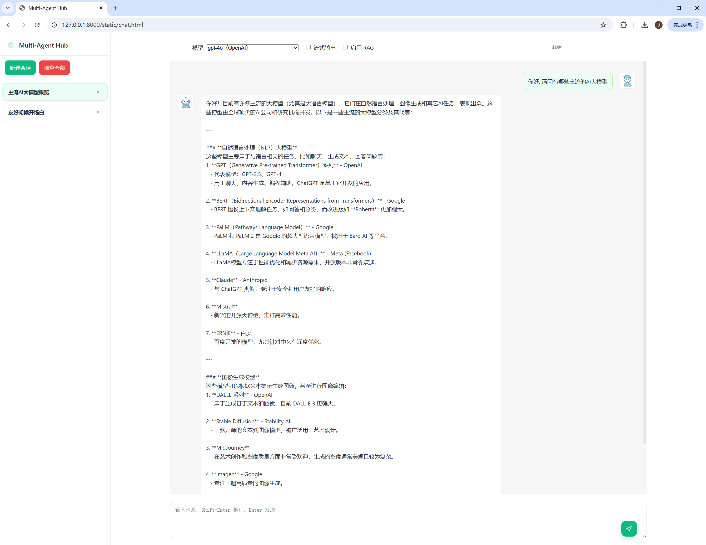

# Multi-Agent Hub (Yaccii Edition)

> 轻量、可落地的多模型对话与 RAG 框架。支持会话管理、流式输出、RAG 文档库、MySQL 持久化、可插拔 Bot 与存储实现。适合作为各类业务的通用对话中台。  
>
> ⚠️ 本仓库为 **通用开源版本（Generic Edition）**，不包含任何公司或特定业务逻辑。更复杂的多 Agent 调度、工作流编排等能力已在公司内部版本中使用，但未在本仓库公开。

---

## ✨ 核心特性

- **多模型 Bot 架构**
  - 通过 `bots/` 统一注册与管理不同模型（如 Anthropic Claude、OpenAI、DeepSeek 等）。
  - 同一套会话/消息管线即可切换不同模型。

- **稳健的消息管线（core/message_service）**
  - 会话历史拼接与裁剪（长度控制）。
  - 支持系统提示注入。
  - 支持开启/关闭 RAG。
  - 支持流式与非流式两种响应方式。
  - 会话自动命名与消息持久化。

- **RAG 集成**
  - 文档入库、分片与向量存储。
  - 基于语义检索的 RAG 查询。
  - 前端支持「数据来源」折叠展示。

- **持久化存储**
  - `MySQLStorage`：生产可用的 MySQL 持久化实现（自动建表、自恢复）。
  - `MemoryStorage`：适合本地开发与调试。

- **简洁前端**
  - 单文件 `web/chat.html` 即可跑通完整链路。
  - 支持模型选择、流式开关、RAG 开关、系统提示等。

- **稳定 API**
  - `/sessions/*` 与 `/messages/*` 的路由与返回结构相对稳定，便于接入自定义前端或第三方系统。

---

## 🧱 项目结构概览

```bash
.
├─ bots/                     # Bot 接入层（模型适配与注册）
│  └─ bot_registry.py        # Bot 注册中心
├─ core/                     # 核心业务服务层
│  ├─ message_service.py     # 消息管线（历史 / RAG / 流式 / 持久化 / 自动命名）
│  └─ session_service.py     # 会话生命周期（创建 / 列表 / 删除 / 标记）
├─ domain/                   # 领域模型
│  ├─ enums.py               # Channel / Role 等枚举
│  ├─ message.py             # Message / RagSource 等模型
│  └─ session.py             # Session 模型
├─ infrastructure/           # 基础设施抽象
│  ├─ config_manager.py      # 配置读取（环境变量 + config.json）
│  ├─ response.py            # 统一响应封装
│  ├─ storage_manager.py     # IStorage 选择（MySQL / Memory）
│  └─ mlogger.py             # 简易日志封装
├─ routers/                  # FastAPI 路由层
│  ├─ message_router.py      # /messages/* 相关接口
│  └─ session_router.py      # /sessions/* 相关接口
├─ storage/                  # 存储实现
│  ├─ storage_base.py                # IStorage 接口定义
│  ├─ storage_mysql.py       # MySQL 存储实现
│  └─ storage_memory.py      # 内存存储实现
├─ web/
│  └─ chat.html              # 原生 DOM 前端单页
├─ config_template.json      # 配置模板（需复制为 config.json）
└─ main.py                   # FastAPI 入口（示例）
```

---

## 🚀 快速开始

### 0) 配置文件初始化

首次运行前，请在项目根目录根据模板创建配置文件：

```bash
cp config_template.json config.json
```

然后根据实际环境修改 `config.json` 中的字段。

> 默认情况下，`infrastructure/config_manager.py` 会从 `config.json` 以及环境变量中读取配置，环境变量可覆盖文件中的同名字段。

### 1) 环境要求

- Python 3.10+
- MySQL 5.7+ / 8.0+（可选，如使用 `MemoryStorage` 可暂不配置 MySQL）

建议使用虚拟环境：

```bash
python -m venv .venv
source .venv/bin/activate  # Windows: .venv\Scripts\activate
pip install -r requirements.txt
```

### 2) 关键配置项

在 `config.json` 或环境变量中，配置以下内容：

- **数据库配置（使用 MySQLStorage 时必填）**
  - `MYSQL_HOST`
  - `MYSQL_PORT`
  - `MYSQL_USER`
  - `MYSQL_PASSWORD`
  - `MYSQL_DB`

- **会话与消息限制（可选）**
  - `max_sessions`：单用户最大会话数（默认 50）。
  - `max_messages_count`：单会话最大消息条数（默认 200）。
  - `max_messages_length`：单条消息最大长度（默认 8000）。

- **模型配置与密钥**
  - `ANTHROPIC_API_KEY`
  - `OPENAI_API_KEY`
  - 其它第三方大模型/推理服务密钥等。

> 首次使用 MySQLStorage 时，`mysql_storage.py` 会自动创建所需数据表：  
> `chat_sessions`、`chat_messages`、`rag_documents`、`rag_chunks`。

### 3) 启动后端服务

以 FastAPI + Uvicorn 为例：

```bash
uvicorn main:app --reload --port 8000
```

- `--reload` 适合本地开发，生产环境建议关闭并使用更成熟的部署方式（例如 gunicorn + uvicorn workers + Nginx）。

### 4) 打开前端

开发阶段可直接用浏览器打开前端文件：

```text
web/chat.html
```

如需由后端托管静态资源，可将 `web/` 目录配置为静态目录并挂载到 Nginx 或 FastAPI 静态路由。

---

## 🖥️ 前端交互说明

`web/chat.html` 提供一个开箱即用的对话界面，主要能力包括：

- **工具栏**
  - 模型选择（与后端配置的 Bot 对应）。
  - `启用流式输出`（`ck-stream`）。
  - `启用 RAG`（`ck-rag`）。
  - 显示当前状态与错误提示。

- **会话列表**
  - 按时间倒序展示会话。
  - 支持删除会话。
  - 切换会话时，会自动同步该会话的 `rag_enabled` 与 `stream_enabled` 标记。

- **消息区**
  - 用户与助手对话气泡分列展示。
  - 助手消息下方为「数据来源」折叠区域（仅在 RAG 查询时展示）。
  - 切换 RAG/流式等状态时，会在消息流内插入系统提示，便于追踪上下文。

---

## 🔌 API 设计

### Sessions

- `POST /sessions/create`  
  创建会话。  
  请求示例：

  ```json
  {
    "user_id": 1,
    "bot_name": "claude-3-5-haiku-20241022",
    "channel": "web"
  }
  ```

  响应示例：

  ```json
  {
    "success": true,
    "data": {
      "session_id": "uuid"
    }
  }
  ```

- `POST /sessions/list?user_id=1`  
  返回当前用户的会话列表。

- `POST /sessions/delete?user_id=1&session_id=...`  
- `POST /sessions/delete_all?user_id=1`  

- `POST /sessions/{session_id}/flags`  
  更新会话标记（如 RAG/流式状态）：

  ```json
  {
    "rag_enabled": true,
    "stream_enabled": false,
    "idempotency_key": "optional-string"
  }
  ```

### Messages

- `GET /messages/history?user_id=1&session_id=...`  
  返回某个会话的历史消息：

  ```json
  {
    "success": true,
    "data": {
      "history": [ /* Message[] */ ]
    }
  }
  ```

- `POST /messages/chat`  
  发送消息并获取回复。

  请求示例：

  ```json
  {
    "user_id": 1,
    "session_id": "uuid",
    "role": "user",
    "content": "你好，帮我解释一下 RAG 是什么？",
    "stream": true,
    "rag_enabled": true,
    "channel": "web"
  }
  ```

  - 当 `stream=false` 时：一次性返回完整回复与数据来源：

    ```json
    {
      "success": true,
      "data": {
        "reply": "……",
        "sources": [ /* RagSource[] */ ]
      }
    }
    ```

  - 当 `stream=true` 时：以 `text/plain` 流式返回，首帧若包含 RAG 源，会在文本头部附带一段元数据：

    ```text
    [[RAG_SOURCES]]{"type":"rag_sources","sources":[{"title":"...","url":"...","snippet":"...","score":0.83,"meta":{"...":"..."}}]}
    （后续为模型增量输出的文本）
    ```

  前端在渲染时会剔除 `[[RAG_SOURCES]]...` 片段，只在折叠面板中展示来源信息。

---

## 🧠 RAG 能力说明

### 数据表与结构

- `rag_documents`：存储文档级别信息
  - 标题、URL、标签。
  - 使用的向量模型版本、维度、预处理参数等。

- `rag_chunks`：存储分片后的文段
  - 每条记录为一段文本及其向量。
  - 标记顺序、所属文档、所属用户（如有多租户需求）。

### 检索与注入

- 通过 `RagService.semantic_search(query)` 进行语义检索。
- 检索结果被封装为 `RagSource` 列表，并在消息管线中构造为系统提示注入到模型上下文中。
- 前端通过折叠面板展示 RAG 来源，便于追踪回答依据。

---

## 🧩 扩展与二次开发

### 1. 扩展 Bot / 模型

1. 在 `bots/` 下新增对应文件（例如 `my_llm_bot.py`），实现统一调用接口。  
2. 在 `bot_registry.py` 中注册一个新的 `bot_name` → 实例映射。  
3. 在前端或调用方传入对应的 `bot_name` 即可使用。

### 2. 更换存储实现

- 若需使用其他数据库或 KV（如 PostgreSQL、Redis 等），可：  
  - 在 `storage/base.py` 定义的 `IStorage` 接口基础上实现新的存储类。  
  - 在 `infrastructure/storage_manager.py` 中增加选择逻辑。

### 3. 业务定制建议

为保持本仓库“通用性”，建议：

- **不要直接在 `core/` / `domain/` 中写业务名词与逻辑。**
- 业务定制可在：
  - 独立私有仓库中引用本仓库作为依赖；或
  - 本仓库中新建 `apps/your_business/` 之类目录，避免与通用层混杂。
- 多 Agent 调度、工作流编排等能力可在业务侧基于现有接口扩展实现，本仓库仅提供基础对话与 RAG 能力。

---

## 📜 许可证

默认使用 MIT License（可根据公司策略调整）。

---

## 🤝 贡献

欢迎通过 PR / Issue 参与完善：

- 新增 Bot 适配器。
- 优化 RAG 检索策略。
- 改进前端交互体验。
- 修复 Bug 与补充测试用例。
